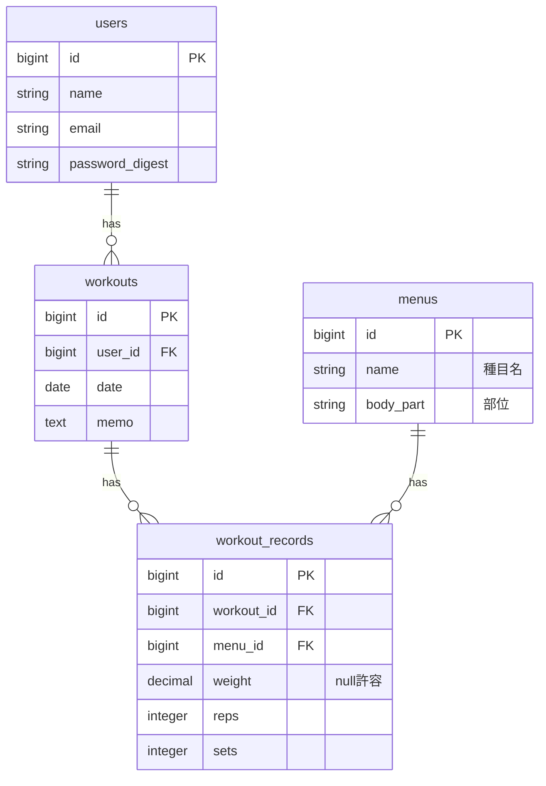

# データモデル設計

manmoss_muscle(筋トレ管理アプリ)のデータモデル定義。
ER図のソースは [er.drawio](er.drawio)(draw.io / diagrams.net で開ける)を参照。

## ER図

## テーブル定義

### users(ユーザー)

登録ユーザー。1 ユーザーが複数のトレーニング(workouts)を持つ。

| カラム | 型 | 制約 | 説明 |
| --- | --- | --- | --- |
| id | bigint | PK | 主キー |
| name | string | | ユーザー名 |
| email | string | | メールアドレス(ログイン用) |
| password_digest | string | | ハッシュ化済みパスワード(`has_secure_password`) |

### menus(種目)

トレーニング種目のマスタ。1 種目が複数の記録(workout_records)から参照される。

| カラム | 型 | 制約 | 説明 |
| --- | --- | --- | --- |
| id | bigint | PK | 主キー |
| name | string | | 種目名(例: ベンチプレス) |
| body_part | string | | 部位(例: 胸) |

### workouts(トレーニング)

ある日のトレーニング1回分。ユーザーに属し、複数の記録(workout_records)を持つ。

| カラム | 型 | 制約 | 説明 |
| --- | --- | --- | --- |
| id | bigint | PK | 主キー |
| user_id | bigint | FK → users.id | 実施したユーザー |
| date | date | | 実施日 |
| memo | text | | メモ(任意) |

### workout_records(トレーニング記録)

1 トレーニング内の 1 種目ごとの記録(重量・回数・セット数)。
workouts と menus の中間に位置する明細テーブル。

| カラム | 型 | 制約 | 説明 |
| --- | --- | --- | --- |
| id | bigint | PK | 主キー |
| workout_id | bigint | FK → workouts.id | 紐づくトレーニング |
| menu_id | bigint | FK → menus.id | 実施した種目 |
| weight | decimal | null 許容 | 重量(自重種目などでは null) |
| reps | integer | | 回数 |
| sets | integer | | セット数 |

## リレーション

- `users` 1 ── n `workouts`(ユーザーは複数のトレーニングを持つ)
- `workouts` 1 ── n `workout_records`(1回のトレーニングに複数の種目記録)
- `menus` 1 ── n `workout_records`(1種目は複数の記録から参照される)

## 補足・検討事項

- **認証方式**: 本 ER 図では `password_digest` を採用しており、Rails 標準の `has_secure_password`(bcrypt)を前提とする。
  [tasks.md](tasks.md) では Devise を想定していたため、いずれかに方針を統一する必要がある。
  Devise を採用する場合は `encrypted_password` 等の Devise 標準カラムに置き換わる。
- 種目(menus)は当面マスタとして共通利用する想定。ユーザーごとのカスタム種目が必要になった場合は `menus` に `user_id` を追加するなどの拡張を検討する。
